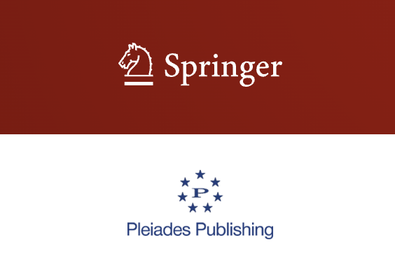

# Estimating Page Ranks with Inductive Capability of Graph Neural Networks and Zone Partitioning in Information Retrieval

##### Suleyman Suleymanzade

##### Institute of information Technology

##### Azerbaijan National Academy of Science

##### Baku, Azerbaijan

##### suleyman.suleymanzade.nicat@gmail.com

### Abstract

Abstract—one of the important features of information retrieval systems is ranking. Ranking performsthe function of ranking search results based on relevance to the user’s query. Methods developed instate-of-the-art research still require multiple iterations. In this paper, we proposed to use zone parti-tioning strategies for computing web page rank parameters in retrieval systems, which implements iter-ative calculation for only some randomly selected subgraphs (zone). The zone approach is based onthe idea to use multiple neural networks to classify rank data in graph-based structures. The crawledweb pages are fragmented into three distinct zones. The core zone is used for training graphconvolutional network, in this zone, the labels are known. It is covered with an undiscovered zone,where classifiers label node parameters. The most interesting part is the intersection zone, which rep-resents the set of nodes and edges that belong to more than one undiscovered zone. The experimentsshow that the probability of classifying the true labels in the intersection zones via aggregating theresults of multiple classifiers in some cases is higher than in undiscovered zones.

__Keywords:__ gnn, pagerank, graph partition, deep learning, graphs

__DOI:__ 10.3103/S0146411625700130

### Setup:

create virtual environment by `virtualenv venv`
then acces to the virtualenv - Linux users `source venv/bin/activate` - Windows users `venv\Scripts\activate`
next install all important python packages by - `pip install -r requirements.txt to install all packages`
then run jupyter notebook in cmd to run the jupyter notebook - `jupyter notebook`

link:
[paper](https://link.springer.com/article/10.3103/S0146411625700130?utm_source=rct_congratemailt&utm_medium=email&utm_campaign=nonoa_20250704&utm_content=10.3103/S0146411625700130)

